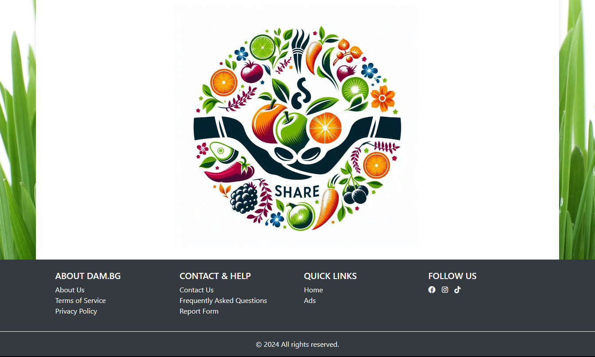

  <h1>DamApp</h1>
  
  
Welcome to Dam Platform! 🌱

Tha Dam Platform is a web application designed to facilitate the exchange and gifting of homegrown produce. Users can list their excess produce for sharing or sale, and others can search for ads based on category. The platform aims to reduce food waste and build a community of like-minded individuals.

This project utilizes a microservices architecture with REST APIs for communication between services.

## Project Overview

The project consists of two main components:

1. **DAM Application (Maven Project)**: The core backend of the platform.
2. **DAM Advertisements (Gradle Project)**: Manages advertisements and image links.

## Technologies Used

### Back-end:
- **Spring Boot** 
- **Spring Data JPA**: For data persistence and repository management
- **Spring Security**: Manages user authentication and authorization.
- **MySQL**: Database to store user data, ads, and other information.
- **ModelMapper**: For object mapping between DTOs and entities.
- **REST API**: Utilizes RESTful services for communication between the core application and advertisement management.

### Front-end:
- **JavaScript**
- **User Experience (UX)**
- **Template Engine/Framework**: Uses Thymeleaf for server-side rendering and Bootstrap for styling and responsive design.

## Features

- **Exchange and Gifting**: Users can exchange, share, or search produce.
- **Search and Filter**: Browse ads by category and find specific products.
- **Profile Management**: Users and administrators can edit their profiles.
- **Internationalization**: Supports multiple languages including Bulgarian and English.
- **Scheduled Jobs**: Automates tasks with periodic operations.

### Database

- **Database**: MySQL.
- **Spring Data JPA**

### Security

- **Spring Security**
- **Roles**: Differentiates between user and administrator roles.
- **Profile Editing**: Allows users and administrators to update their profiles.

### Validation and Error Handling

- **Validation**: Both client-side and server-side validation mechanisms.
- **Error Messages**: Informative validation messages for users.

### Internationalization (i18n)

- **Languages Supported**: Bulgarian and English.

### Scheduling

- **Scheduled Jobs**: Implemented scheduled jobs affecting the application.

### Additional Features

- **AOP**: Implements Advice.
- **File Storage**: Cloudinary for cloud-based image storage.

## Screenshots

Here are some screenshots of the Dam Platform in action:

- **Home Page**
  

- **Home Page - Footer**
  

- **Exchange Listing**
  

*Screenshots may vary depending on the application version.*

## Getting Started

To get started with the DAM Application, follow these steps:

1. **Clone the Repository**
2. **Navigate to the Project Directory**
3. **Install Dependencies**
    Make sure you have the necessary dependencies installed.
4. **Replace the placeholders**
    To start the project, please replace the placeholders in your configuration file with your actual credentials.
5. **Run the Application**
    Follow the instructions for running the application locally or deploy it to your server.
6. **Access the Platform**
    Open your web browser and navigate to start using the DamApp.

## License

This project is licensed under the MIT License. See the [LICENSE](LICENSE) file for details.
